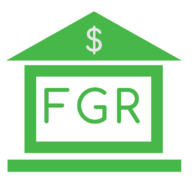

# FGR Budget Frontend

[](https://fgr-kubernetes-demo.northcentralus.cloudapp.azure.com)

This is the frontend microservice used in the [Kubernetes Demo](https://frankieriviera.com/portfolio/kubernetes-demo) by [Frankie Riviera](https://frankieriviera.com)

### Docker image
The Docker image for this microservice can be found on [docker hub](https://hub.docker.com/repository/docker/dariv94/kubebud_frontend)

# Develpment

## Getting Started

### Env Vars

*NOTE:* when using create-react-app all env vars must start with **REACT_APP**  

Example .env
```
REACT_APP_PROJECT_ENV=sandbox
REACT_APP_FGR_BUDGET_BACKEND_URL=http://localhost:4500
REACT_APP_FGR_CHECK_BACKEND_HEALTH=false
```

**REACT_APP_PROJECT_ENV** is the set to *sandbox* in order for the backend and Plaid LINK to know to call the sandbox Plaid API. Any other value would result in the backend and or LINK making a call to connect to a real bank. 

**REACT_APP_FGR_BUDGET_BACKEND_URL** is the url of the [FGR-budget-backend](https://github.com/DaRiv94/fgr-budget-backend-v2). A Note, when running in a kubernetes cluster and using an ingress-service and routing traffic, this env var may be something simple like `/api` depending on how you set up your ingress-service paths.

**REACT_APP_FGR_CHECK_BACKEND_HEALTH** is set to *true* if you want to login streen to have an addtional component with an input box and a button that allows to check your connection and the health of your FGR-budget-backend. The backend has an endpoint at /healthy for this purpose. Any setting other than true will result in false.

### Starting app
Once you have your .env file at the root of your project you can start up the frontend container for development with 
`docker-compose up`

---
### NOTE TO SELF When Developing with Windows 10 Home
Docker Toolbox does not play nice with docker-compose, so when I am developing with a windows 10 Home machine use the following cmd
`docker run --rm -p 3000:3000 --name fgr-budget-frontend-v2_web_1 --network budget --env-file .env -e CHOKIDAR_USEPOLLING=true -v /app/node_modules  -v /c/Users/frank/OneDrive/Development/02_Projects_In_Production/0027_PersonalBudgetApp/fgr-budget-frontend-v2:/app frontendv2`
